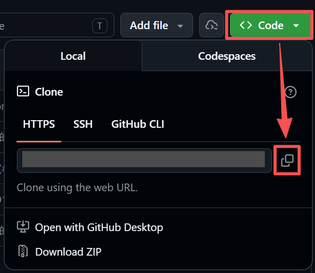

# 开发前要做的

## 1. 检查环境

打开终端，输入以下命令检查 Git 是否可用：

```bash
git --version
```

如果看到类似 `git version 2.40.0` 的输出，说明 Git 已安装。如果没有，可以前往 [git-scm.com](https://git-scm.com/) 下载安装。

如果你使用了**代理工具🪜**来访问 GitHub，请在代理工具的设置页面找找它的端口是什么，记住这个端口号。

在终端中输入以下命令来设置 Git 代理：

```bash
git config --global http.proxy 127.0.0.1:端口号
git config --global https.proxy 127.0.0.1:端口号
```

可通过以下命令来检查是否设置成功：

```bash
git config --global http.proxy
git config --global https.proxy
```

如果这两个命令的结果都是你刚刚设置的内容，那说明设置成功了。

## 2. 克隆仓库

**从 GitHub 克隆团队仓库到本地。**

1. 打开 GitHub 上的团队仓库页面
2. 点击绿色的 **Code** 按钮，复制 **HTTPS** 地址（形如 `https://GitHub.com/用户名/仓库名.git`）
   
3. 在终端中执行：

    ```bash
    git clone 你刚刚复制的地址
    ```

这会在当前目录下创建一个**与仓库同名的文件夹**，里面包含完整的项目文件和历史记录。

## 3. 打开仓库文件夹

用 VS Code 打开刚刚克隆下来的仓库文件夹，点击左侧的源代码管理图标，打开**源代码管理**页面，应该就能看到仓库的提交记录了。


接下来可以开始开发了。
