# 开发流程

每次开发一个**模块**、**子功能**，都遵循以下流程。一个完整的流程分为八个步骤，熟练之后操作起来很快的。

整个流程其实是围绕提交、分支、Pull Request 展开的。

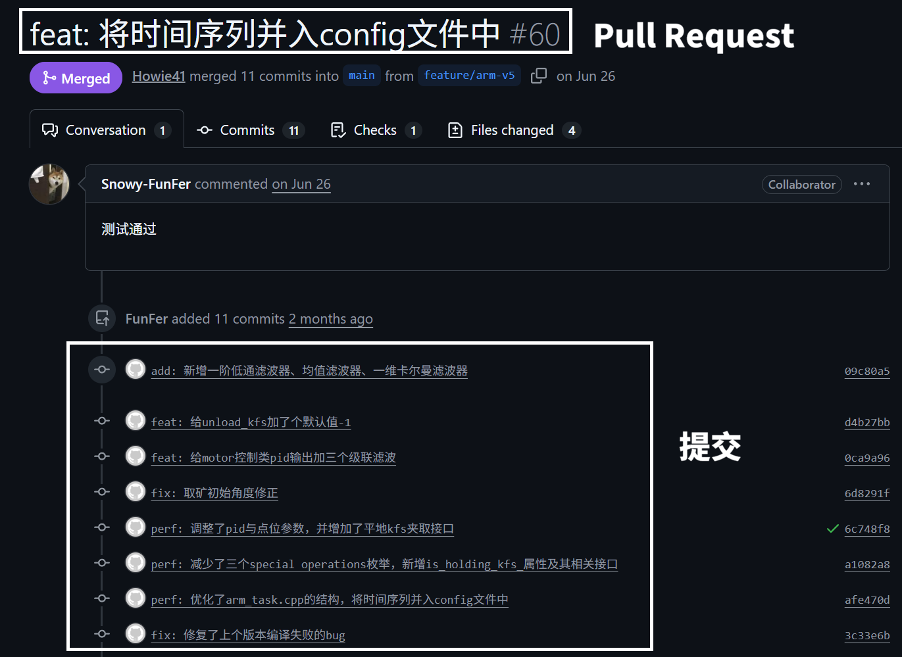

## 1. 拉取主分支

> [!tip]
> 
> ❓第一次听说分支？[分支是什么?](qa.md#分支是什么)

先看看 VS Code 最下方的状态栏，检查一下**当前所在的分支是不是主分支**。

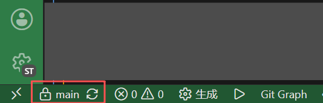

在源代码页面做一次拉取操作，目的把主分支同步到最新状态。

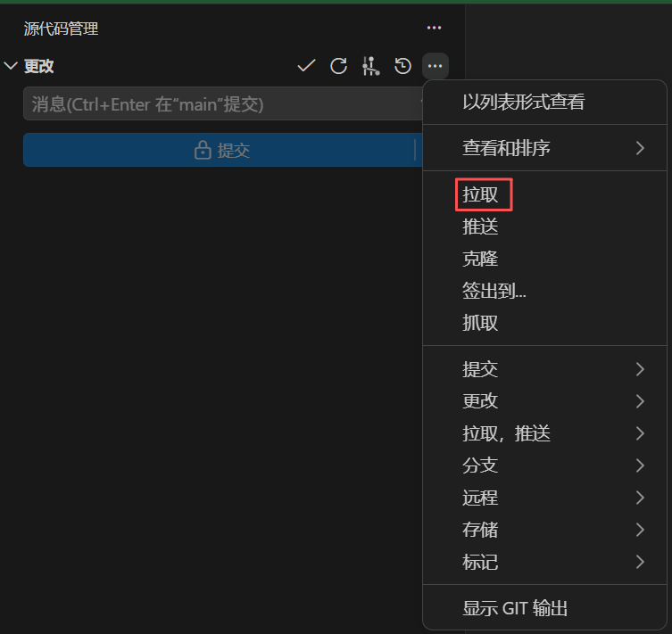

## 2. 创建开发分支(Dev Branch)

在源代码管理页面，如图所示，选择【创建分支...】

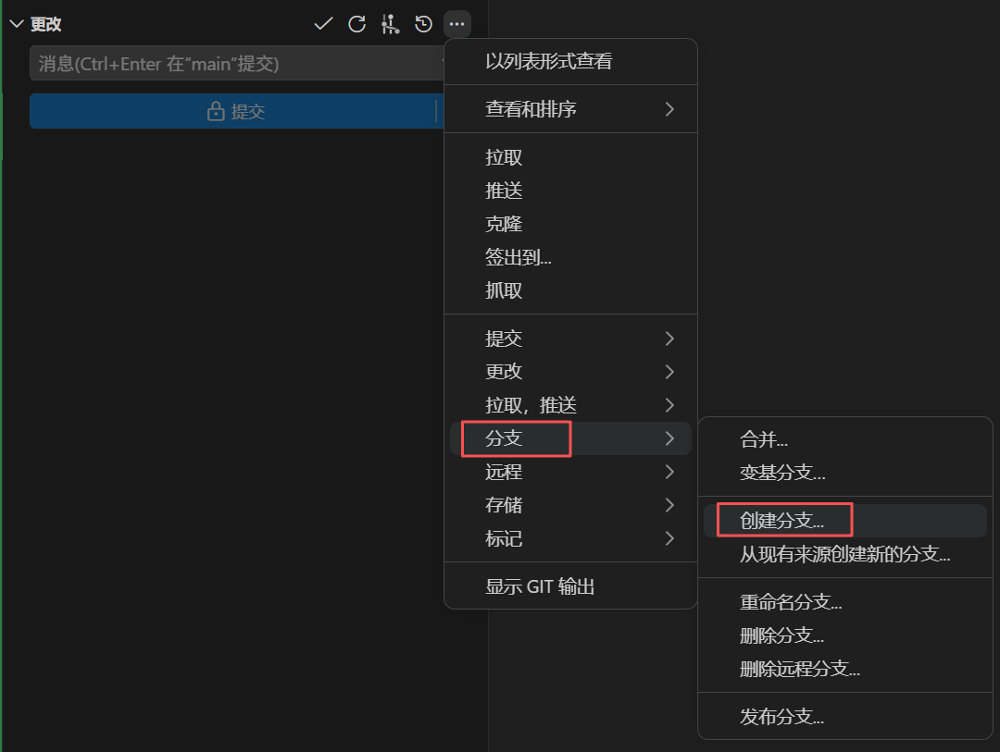

输入分支的名字，按回车键创建。

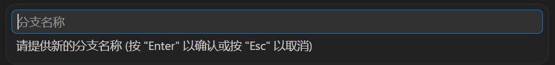

> [!note]
>
> ❓**清晰的分支名有利于团队交接、分支管理。详见 Q&A 章节 [怎么给分支起名字?](qa.md#怎么给分支起名字)。**

创建后，Git 会自动进入到这个分支，此时的修改、提交都发生在个人的开发分支，不会影响到主分支的文件。

你也可以看看 VS Code 底部状态栏，看看**当前所在的分支是不是开发分支**。

创建分支后，有一个高亮的【发布 Branch】按钮。点击它，这个分支会同步到远程仓库，同学就能看到你的分支了。

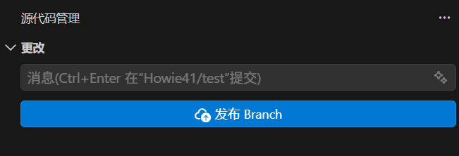

## 3. 写代码

当你保存代码文件，Git 会追踪这些改动。

VS Code 的源代码管理页面，有改动的文件会显示出来。

> [!note]
>
> ❓**你或许会留意到，文件名旁边出现了金色的`M`或者绿色的`U`。详见 Q&A 章节 [文件名旁边的字母是什么意思?](qa.md#文件名旁边的字母是什么意思)。**

## 4. 暂存, 提交

> [!tip]
> 
> ❓第一次听说提交？[提交是什么?](qa.md#提交是什么)

**Git 默认不会把这次所有的改动都存下来**，而是由你来**挑选**哪些文件要记录到这次提交。

挑选的办法很简单：在源代码管理页面，点击对应文件名右侧的加号 `+`（暂存更改）。

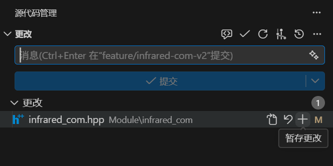

点击后，这个文件就会移动到 **暂存的更改** 分组下，这表示这个文件已被**暂存**。

**Git 只会把暂存状态的文件记录到提交里。**

当你挑好文件，就在【消息】输入框给这次提交写一段提交信息，比如新增了什么功能，修复了什么问题等等。

做好这一切后，然后点击 **提交** ，一次提交就创建好了。

提交之后， **提交** 按钮会变成 **同步更改 1↑** 。点击它，这次提交就会同步到远程仓库，同学可以切换到你的分支来查看这次提交。

**重复第 3 步、第 4 步，在分支上不断迭代更新。直到你认为这个开发分支的任务完成了，可以合并到主分支时，进入第 5 步。**

## 5. 新建 Pull Request

当你**做完这个功能的开发，完成了这个分支的任务，编译通过、实机测试通过后**，就可以把这个分支合并到主分支，这个操作需要通过 Pull Request 来完成。

> [!tip]
>
> ❓第一次听说 Pull Request？[Pull Request 是什么?](qa.md#pull-request-是什么)

打开 GitHub 仓库页面 → Pull Request → **New Pull Request**。 

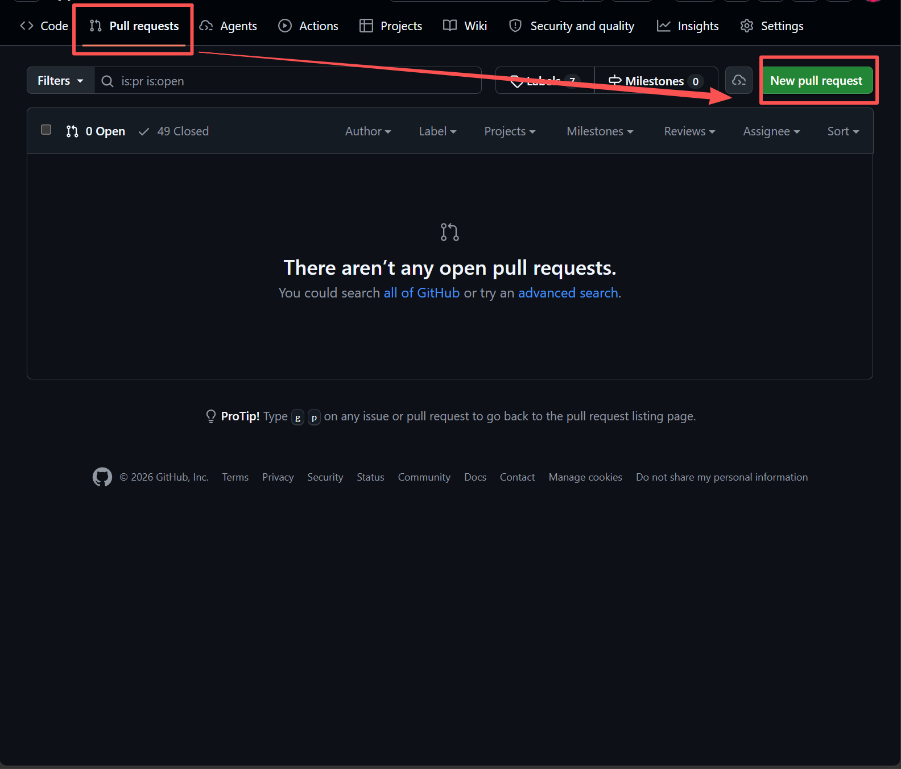

在 compare 处选择你的开发分支。

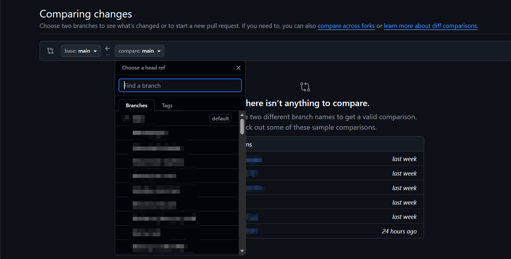

稍等一下，如果显示 Able to merge，就可以点击 **Create Pull Request** 来创建 PR 了。

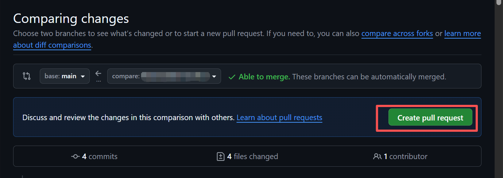

然后给这个 PR 写一个标题，写一些描述，告诉团队这个开发分支做了什么，有什么新功能，以及注意事项等等。之后点击 **Create Pull Request** 就可以开启 PR 了。

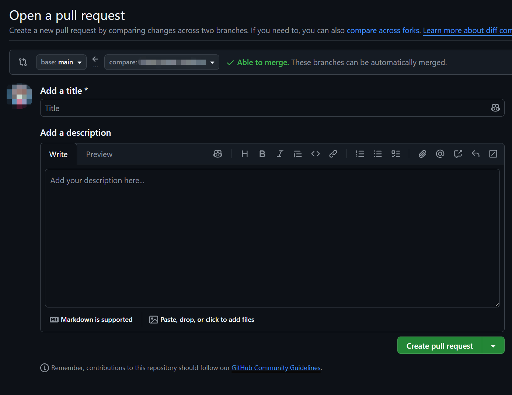

## 6. 审查代码

接下来通知你的同学，让他们来审查你的代码。PR 的创建者自己不需要做审查这一步。

### 审查者怎么做

审查也是在 **GitHub 的 PR 页面**上完成的。操作路径如下：

打开 PR 页面，在仓库的 Pull Request 列表中找到这个 PR 并点击进入。

切换到 **"Files Changed"** 标签，这里会展示这个分支的改动（绿色行 = 新增，红色行 = 删除）。

审查者如果发现某一行有问题，把鼠标悬停在那一行上，点击左侧的 `+` 号，可以针对这一行发表评论。

看完所有文件后，点击右上角的 **"Submit review"** 按钮，会弹出三种选择：

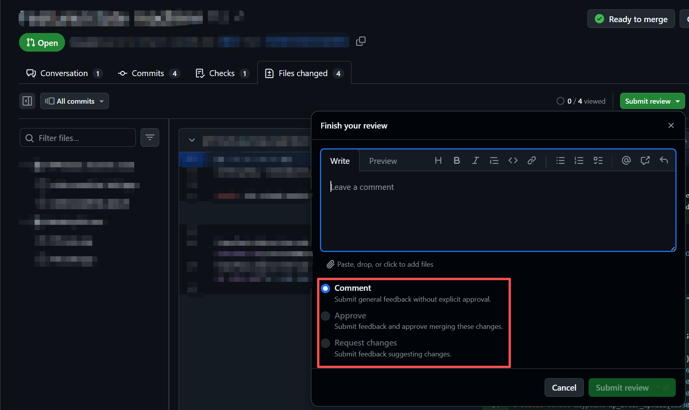

| 选项 | 含义 | 什么时候用 |
|---|---|---|
| **Comment（评论）** | 发表评论、意见 | 有疑问但不需要修改时 |
| **Approve（批准）** | 代码没问题，同意合并 | 审查通过后 |
| **Request Changes（请求修改）** | 代码有问题，不能合并，必须修改后才能合并 | 代码有 bug 或设计问题时 |

点击 **Submit review**，确认提交审查结果。

### 如果收到修改请求

如果你（PR 的创建者）收到同学的 "Request Changes"，不需要重新提交 PR——只需要在本地修改代码有问题的部分，然后按照第 4 步那样去提交，PR 就会自己更新，审查者可以看到新的改动并重新审查。

直到审查者发送 **Approve** 的结果，即同意合并后，这一步才算是完成。

## 7. 在 Pull Request 中合并

当团队完成了代码审查后，就可以正式合并你的分支。

在 PR 页面最底部，如果没有冲突，就会显示 No conflicts with base branch，此时可以进行合并。

> [!note]
>
> 如果提示有冲突（Conflicts），不能合并，参阅 [如何处理冲突?](qa.md#如何处理冲突) 。

> [!warning]
>
> **注意：不要直接点击 Create a merge commit，而是点击旁边的倒三角，选择 Squash and merge。**

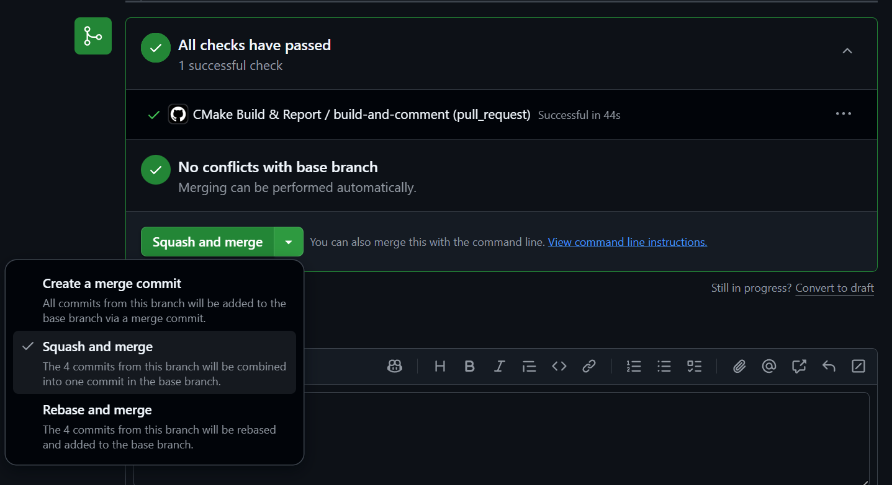

接下来需要填写 PR 的 Commit Message，即提交信息。为了便于项目维护和管理，提交信息与分支名称有类似的规则。

> [!note]
>
> ❓**提交信息怎么写？详见 Q&A 章节 [提交信息怎么写?](qa.md#提交信息怎么写)。**

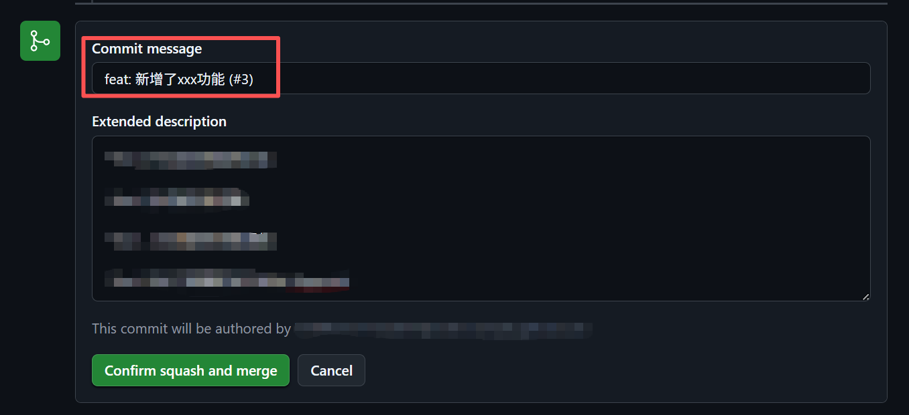

点击 **Confirm squash and merge**，至此，这个分支正式合并到主分支了。

## 8. 回到主分支

回到 VS Code，如图所示，点击 **签出到...** (对应到 `git checkout` 命令)

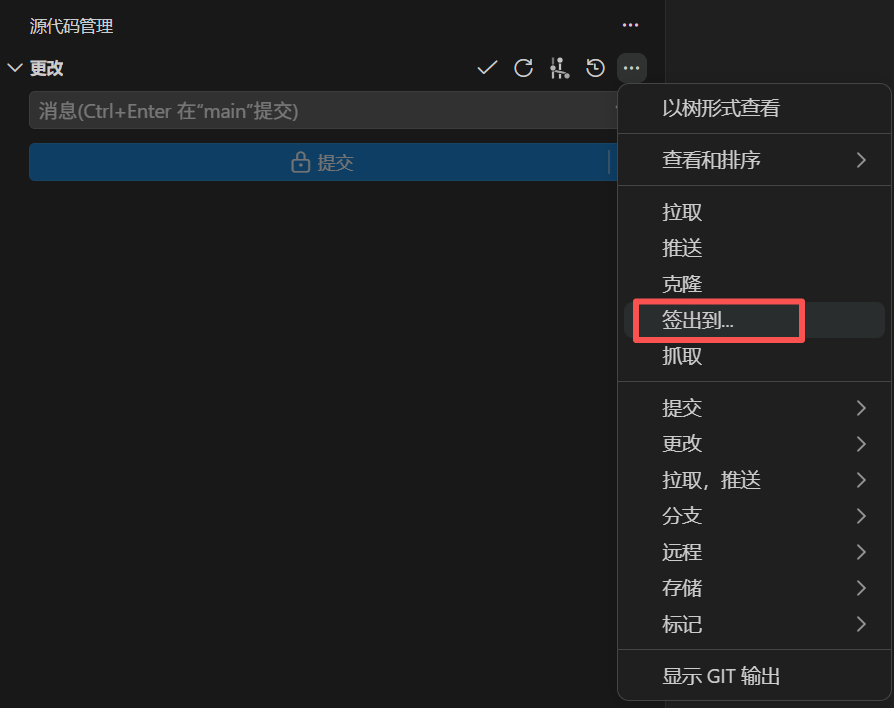

在弹出的输入框中输入 `main`，选择 `main`（**不是** `origin/main`）。

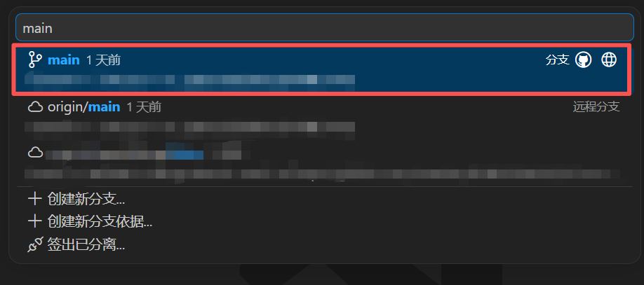

在源代码管理页面做一次拉取操作，把主分支同步到最新状态。同时**也通知其他同学切到主分支并拉取**，以同步主分支最新的修改。

至此，一轮开发流程就结束了。

原来的开发分支**不再继续使用**，后续的开发需要回到第一步 [1. 拉取主分支](#1-拉取主分支) ，再另起一个新开发分支进行。

> [!tip]
>
> 如果后续要继续修改这个模块、子功能的内容……
>
> 例如：原开发分支叫 ` feature/chassis-solver`：
>
> - 要迭代新版本，创建分支`feature/chassis-solver-v2`
> - 要修复第一版的问题，创建分支 `fix/chassis-solver`

## Tips

- 实际开发过程中，步骤的进行是这样的：`1→2→3→4→...→3→4→5→6→7→8 →1→2→3→4...`。

  - 熟悉这套流程后，你还可以同时维护多个开发分支，同时做多个功能。
- 并不是所有分支的结局都是 PR 合并到主分支。如果有做正式版、测试版的需要，或者是要测试另一种技术方案，都可以创建一个**长期分支**，不合并到主分支，和主分支并行。
