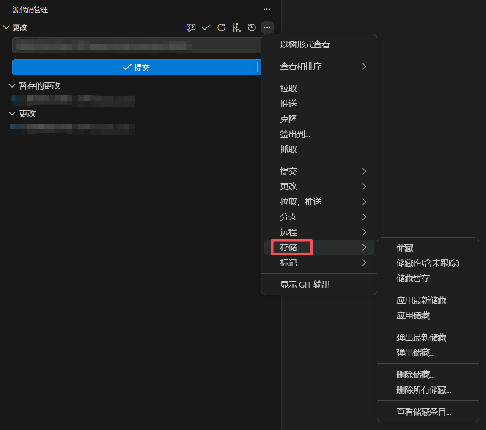
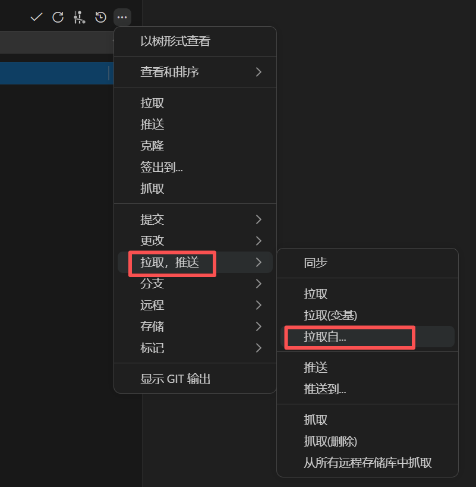

# Q&A

## 分支是什么?

**分支（Branch）** 可以理解成一条**平行的时间线**。

Git 默认创建一条主分支（分支名通常是 `main` 或 `master`），上面串着项目从开始到现在的所有提交，就像一条珍珠项链。

当你准备开发新功能或修复问题时，可以从主分支"分叉"出一条新的开发分支：

- 在这条新分支上随意提交、修改、试验
- **不会影响到主分支上的代码**
- 等开发完成、测试通过后，再把这条分支**合并（Merge）**回主分支

就像在平行宇宙里做实验——做砸了也不要紧，主宇宙毫发无损。

简单说：**分支让你在不影响主线的情况下独立开发，开发完了再合并回去。**

所有人的代码最终都会合并到这里，必须保证这个分支里的代码是**最新的、编译通过的、功能正常的**。

---

## 提交是什么?

**提交（Commit）** 可以理解成打游戏时的**存档点**。

每次你执行"提交"，Git 就会把当前暂存区里的文件的"快照"保存下来。每个提交都包含：

- 一个独一无二的 ID（一串像 `a1b2c3d` 的哈希值）
- 作者是谁、什么时候提交的
- 一段提交信息，说明这次做了什么

正因为有提交，你才可以：

- 随时回到过去的任意一个存档点
- 对比两次存档之间的变化
- 出问题时，把代码回滚到之前的版本

简单说：**提交就是给代码拍一张带说明的快照，是 Git 记录历史的基本单位。**

---

## Pull Request 是什么?

**Pull Request（简称 PR，合并请求）** 是 GitHub 提供的**代码审查与合并机制**。

当你在开发分支上完成了功能开发，不能直接把代码塞进主分支——而是要发起一个 PR，相当于说："我这边改好了，请审查一下，没问题的话合并到主分支。"

一个 PR 包含：

- **标题和描述** —— 告诉团队这个 PR 做了什么
- **文件变更对比** —— 展示这个分支改了哪些代码（绿色 = 新增，红色 = 删除）
- **审查与讨论** —— 团队成员可以在 PR 页面上逐行评论、提出问题
- **审查结论** —— Comment（评论）、Approve（批准）、Request Changes（请求修改）

审查通过后，点击合并，开发分支的代码就正式进入目标分支了。

简单说：**PR 就是"请审查我的代码，然后合并"的请求，是团队协作的核心环节。**

**PR 不是 Git 的功能，是 GitHub 的功能。** Git 本身只有分支和合并，PR 是 GitHub 在 Git 之上附加的审查流程。

在 VS Code 里写代码、提交、推分支，在 GitHub 网页上发 PR、做审查——两边的分工大致就是这样。

---

## 怎么给分支起名字?

**命名规则：**

- 前缀 + `/` + 简短描述，全部使用**小写英文**和**连字符 `-`**
- 描述要有意义，让人一眼看出这分支在做什么
- 不要太长，5 个以内的单词比较合适
- 末尾不要加句号

| 前缀 | 用途 | 示例 |
|---|---|---|
| `feature/` | 新功能开发 | `feature/login-page` |
| `fix/` | 修复 bug | `fix/user-avatar-crash` |
| `refactor/` | 重构代码，不改功能 | `refactor/api-routes` |
| `chore/` | 杂项（依赖升级、配置调整等） | `chore/upgrade-vue-3` |
| `docs/` | 只改注释/文档 | `docs/api-readme` |

✅ 好的命名：

```text
feature/order-history
fix/payment-timeout
refactor/user-auth
```

❌ 不好的命名：

```text
abc123              ← 看不出目的
my-branch           ← 太模糊
feature/add-order-history-page-and-fix-bugs  ← 太长，一个分支只做一件事
Fix/Login-Page      ← 不应该用大写字母
```

> [!TIP]
>
> **为什么要这样命名？**
>
> - **让所有人一眼看懂** —— 看到 `fix/` 就知道这是个修复，看到 `feature/` 就知道是新功能。团队里其他人（包括你未来的自己）光看分支名就能理解意图。
> - **自动化和 CI/CD** —— 很多团队的工具链会根据分支前缀自动触发不同的流水线。比如 push `fix/` 分支时自动跑测试，但只有 merge 到 `main` 才自动部署。
> - **分支列表一目了然** —— 项目做久了分支会很多，统一前缀能自动把分支按类别分组，方便清理和查找。
>
> 简单说：分支名是写给团队看的。名字清楚，沟通成本就低。
>


---

## 提交信息怎么写?

提交信息也有一套约定俗成的规范（Conventional Commits），和前文的分支命名很像，只是前缀略有不同。最常见的有：

| 前缀 | 含义 | 对应分支前缀 |
|---|---|---|
| `feat:` | 新功能，新模块 | `feature/` |
| `fix:` | 修复 bug，修复问题 | `fix/` |
| `refactor:` | 重构代码，只改变代码，但表现出来的功能不变 | `refactor/` |
| `chore:` | 杂项（依赖、配置等） | `chore/` |
| `docs:` | 只改动了注释、文档 | `docs/` |

格式：`<前缀>: <简短的描述>`。描述用中文写。

✅ 好的提交信息：

```text
feat: 添加用户登录页面
fix: 修复头像加载超时问题
chore: 升级 vue 到 3.4 版本
```

❌ 不好的提交信息：

```
7月10日提交                ← 与修改内容无关
fix: 修复 bug              ← 描述太笼统，不能看出具体修改
docs: 修复了头像加载超时问题  ← 搭配了错误的前缀
```

> **提交信息是写给团队和未来的自己看的**——几个月后翻提交历史，一眼就能知道当时做了什么。

---

## 文件名旁边的字母是什么意思?

在源代码管理面板中，每个文件旁边都会有一个字母标记，表示它当前的状态：

| 状态标记 | 含义 | 说明 |
|---|---|---|
| `U` | **Untracked（未追踪）** | 新创建的文件，Git 还没开始追踪它。你需要先"暂存"（点击 **＋** ）Git 才会记录它的变更。 |
| `A` | **Added / Staged（已暂存）** | 新创建的文件已被暂存。提交后，Git 就会开始追踪这个文件。 |
| `M` | **Modified（已修改）** | 改动了 Git 已经追踪的文件。 |
| `D` | **Deleted（已删除）** | 删除了 Git 已经追踪的文件。|

---

## 如何切换/签出到分支?

**切换分支**就是把当前的工作环境从一条分支换到另一条分支上。切换后，工作区里的文件会变成目标分支的样子。

（VS Code 里的 **签出到...** 功能可以简单理解为切换分支）

> [!note]
>
> 切换分支前，**确保当前工作区的修改都已经提交/暂存**。
>
> 如果有未提交的改动，Git 可能会弹出警告，可以考虑先储藏再签出（参阅 [储藏是什么? 怎么用?](#储藏是什么-怎么用)）。

### 通过 VS Code 切换

通过 VS Code **源代码管理面板**中的"签出到"功能：

1. 在面板顶部，找到当前分支名称的旁边，点击 **"签出到..."**（或类似的分支切换入口）。

   

2. 在弹出的下拉列表中，选择你要切换到的分支。

   

3. VS Code 会自动切换分支，工作区中的文件会同步更新。

### 通过底部状态栏快速切换

VS Code 最底部有一行状态栏，显示的就是**当前所在的分支名**。点击它，相当于点击了【签出到...】，会弹出一个下拉列表，选择要切换到的分支即可。


---

## 储藏是什么? 怎么用?


**储藏（Stash）** 的作用是：把你当前工作区中**还没提交的改动**暂时存放到一边，让工作区恢复干净，等之后再取回来。

什么时候需要储藏？

- 正在写代码写了一半，突然需要切换到其他分支看个东西
- 不想把半成品提交到仓库，但又需要清空工作区
- 拉取代码前发现有未提交的改动，但不想直接提交

在 VS Code 的**源代码管理面板**中，点击顶部菜单栏的 **"..."（更多操作）**，会看到 "存储"（Stash）相关的选项：



| 操作 | 说明 |
|---|---|
| **储藏（Stash）** | 把所有未提交的改动保存起来，工作区恢复到没有更改的干净状态。储藏时会弹出一个输入框要求输入信息，用于给这个储藏备注，方便日后识别。 |
| **应用储藏（Apply Stash）** | 把最近一次储藏的内容恢复到工作区，但**保留**这次储藏记录。适合想把同一份储藏应用到多个分支时用。 |
| **弹出储藏（Pop Stash）** | 把最近一次储藏的内容恢复到工作区，同时**删除**这次储藏记录。最常用。 |
| **删除储藏（Drop Stash）** | 直接删除某次储藏记录，不恢复内容。 |
| **查看储藏条目** | 可以看到所有已储藏的条目列表，点击某一条即可查看具体内容。   |

储藏可以有多条，像栈一样后进先出。

如果不再需要某次储藏，可以**删除储藏**来清理。

**储藏不推送到远程仓库**。它只存在你的本地，存在 `.git` 文件夹里。

---

## 如何处理冲突?

**冲突**发生在拉取（pull）或在 GitHub 上合并 PR 时，当两个人**改了同一个文件的同一段代码**，Git 不知道该保留谁的，就会停下来让你手动解决。

> [!TIP]
>
> **冲突不是错误，是 Git 的保护机制。** 它在保护你的代码不被别人意外覆盖。
>
> 处理冲突是日常开发中的正常操作，不用怕。
>
> 如果不确定该保留谁的代码，找写那行代码的同学一起确认。

当你遇到冲突时，冲突文件里会出现`<<<<<<<`、`=======`、`>>>>>>>`这样的标记：

```cpp
<<<<<<< HEAD
// 这个区域显示的是你在当前分支上写的代码
=======
// 这个区域显示的是别人在目标分支上写的代码
>>>>>>> main
```

**每行标记的意思：**

| 标记 | 含义 |
|---|---|
| `<<<<<<< HEAD` | 冲突开始标志。`HEAD` 表示你当前所在分支的版本 |
| `=======` | 分隔线。上面是你的代码，下面是对方的代码 |
| `>>>>>>> main` | 冲突结束标志。`main` 表示对方分支的名字，或者是提交的哈希值 |

### 如果冲突发生在 VS Code

1. 打开有冲突的文件（有冲突的文件，文件名右侧会显示红色的感叹号）。
2. 找到 `<<<<<<<` 到 `>>>>>>>` 之间的区域（VS Code 会把冲突的段落高亮显示）。
3. 根据实际情况，做三件事之一：
   - **保留你的代码** —— 删掉对方的代码和所有标记行
   - **保留对方的代码** —— 删掉你的代码和所有标记行
   - **两者都保留** —— 手动调整代码，把两边的改动合并成最终版本，然后删掉所有标记行
4. 保存文件。
5. 在 VS Code 的源代码管理面板中，点击冲突文件旁边的 **"＋"** 暂存，然后按正常步骤提交。

### 如果冲突发生在 GitHub PR 合并时

1. PR 页面有如下的提示，点击 **Resolve conflicts** ，在网页端完成冲突处理。
   

> [!note]
>
> 如果 **Resolve conflicts** 按钮是灰的，并且提示 "too complex to resolve on GitHub"，表示冲突太复杂了。
>
> 这种情况一般是这个 PR 的分支太久没有同步主分支导致的，可参阅 Q&A [我在开发分支里, 怎么把主分支的最新修改同步过来?](#我在开发分支里-怎么把主分支的最新修改同步过来) 里的办法同步主分支，并处理冲突，然后再回到 PR 页面去合并。

2. 找到 `<<<<<<<` 到 `>>>>>>>` 之间的区域。

3. 根据实际情况，做三件事之一：

    - **保留你的代码** —— 删掉对方的代码和所有标记行
    - **保留对方的代码** —— 删掉你的代码和所有标记行
    - **两者都保留** —— 手动调整代码，把两边的改动合并成最终版本，然后删掉所有标记行

4. 点击 **Mark as resolved** 。

    

5. 返回 PR 页面，继续完成合并操作。

---

## 如何处理 `.ioc` 文件的合并冲突?

`.ioc` 是 CubeMX 的项目文件。虽然它通过文本形式存储，但是奇怪的顺序和结构并不适合让人类和 Git ~~以及 AI~~来理解。

有时候明明正常修改，Git 也会认为有冲突。

即便全部应用当前更改/传入的更改，有时会把文件弄坏，导致 CubeMX 加载不了。遇到这种情况，可以尝试这样操作：

0. 先记住自己想改什么配置，比如启用了哪个串口、开了哪个 DMA 等等。

1. 提示需要处理合并冲突时，在项目目录下打开终端，运行：

   ```bash
   git checkout --theirs -- **/*.ioc
   ```

   它的含义是，强制将项目所有目录下的 `.ioc` 文件，**全部替换为"对方"（传入的更改）的版本**。这样做是为了保留其他同学的修改。

2. 关闭正在运行的 CubeMX。重新打开项目文件夹下的 `.ioc` 文件。

3. 按照需求改配置。

4. 保存，点 **Generate Code**。完成后，把相关文件的变更添加到暂存区（在 VS Code 源代码管理页面里点加号）。

5. 处理完其余合并冲突后，点击源代码管理页面里的**继续**。


> [!tip]
>
> 谨慎用 AI 处理 `.ioc` 冲突，因为 AI 都不信任自己的（（：
>
> > 如果是普通代码（比如 `.c`、`.h` 或 Python、JS 文件），AI 合并的可靠性相当高。
> >
> > 但如果是 **`.ioc` 这种硬件配置文件，千万不要相信 AI 的合并，一信一个不吱声。**
> >
> > ##### AI 缺乏"硬件约束脑"
> >
> > AI 只是一个**文本概率模型**，它并不真正懂得 STM32 的物理芯片架构。
> >
> > - **逻辑冲突**：你在 A 分支把 `PA9` 设成了串口发送（TX），同学在 B 分支把 `PA9` 设成了普通输入（Input）。
> > - **AI 的盲区**：AI 可能会为了"迎合"双方，把这两段配置文本都保留下来。但它不知道在物理上，一个引脚在同一时刻**只能有一种功能**。这种致命的硬件冲突，AI 是无法在文本层面感知到的。
> >
> > ##### `.ioc` 格式对拼写和格式"零容忍"
> >
> > CubeMX 的 `.ioc` 文件是给 CubeMX 软件看的，不是给人类看的。它里面有大量的内部临时 ID 和特定的缩排规则。
> >
> > - AI 在合并长文本时，极容易产生**幻觉（Hallucination）**，可能会多删一个括号、写错一个外设代号（比如把 `USART1` 误写成 `USART`），或者漏掉某行关联配置。
> >
> > - 一旦格式有一丁点儿不合规，CubeMX 就会直接报 **"Invalid File"**（文件损坏），导致你之前所有的配置付之一炬。
> >
> > ……
> >
> > ——Gemini 的回答

## 我在开发分支里, 怎么把主分支的最新修改同步过来?

有时候在自己的开发分支里写到一半，同学的代码合并到了主分支，而我需要用他的代码。这种情况可以这样做：

1. 签出到主分支，然后进行拉取，确保主分支是新的（参阅 [1. 拉取主分支](development-workflow.md#1-拉取主分支)）。

> [!note]
>
> ❓签出时，如果提示"签出会覆盖本地更改"，可以选择 **储藏并签出**。详见 Q&A 章节 [储藏是什么? 怎么用?](#储藏是什么-怎么用) 。

2. 签出到开发分支，然后点击【拉取自...】，在弹出的输入框里选择 `main` 主分支（**不是** `origin/main`），目的是把主分支上别人新写的代码，同步/合并到 PR 的分支里来。



> [!tip]
>
> 这不是唯一的解法。
>
> 在你熟悉 Git 各项操作后，可以尝试变基（Rebase）操作，把自己的开发分支"嫁接"到最新的主分支上。
>
> 但那样做是改写历史的操作，建议熟悉 Git 之后再尝试！

---
